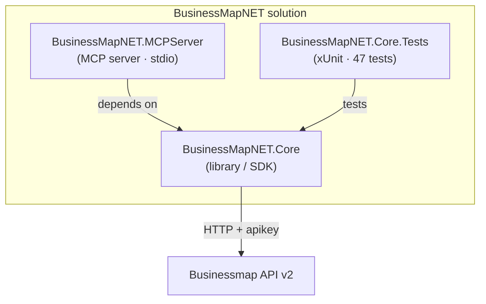
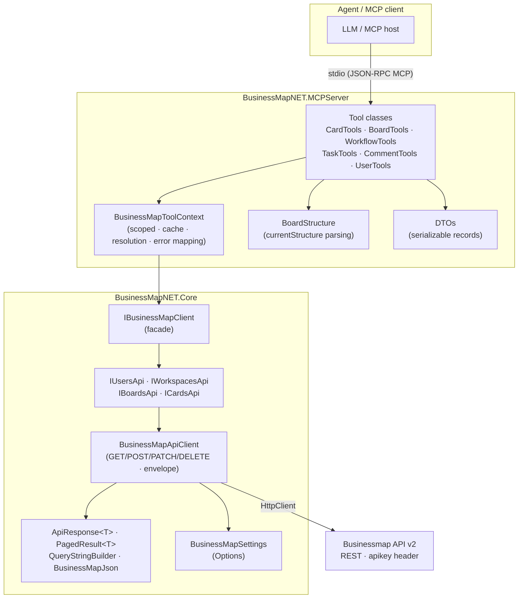
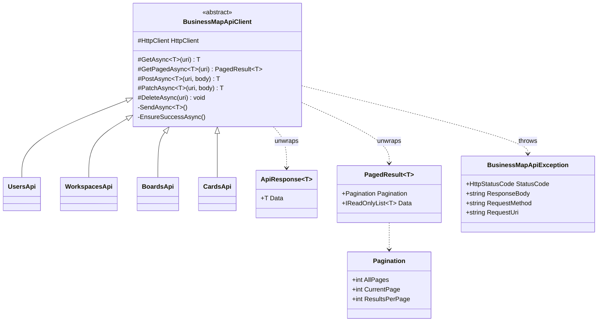
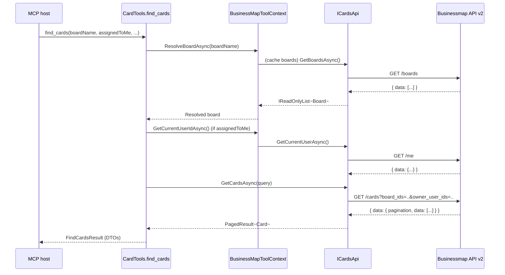
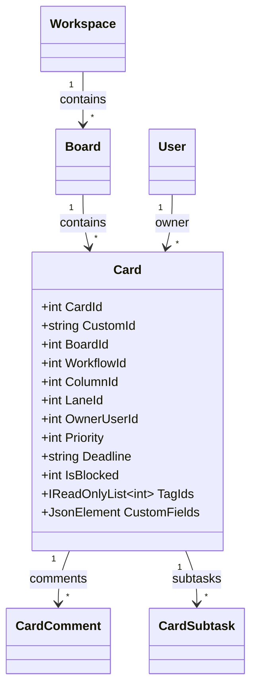

# BusinessMapNET

> **.NET SDK + MCP server** for **Businessmap / Kanbanize**. It lets an AI agent manage boards,
> cards, comments and checklists **using natural language**, without needing to know the tool's
> internal identifiers.

📄 *Languages: **English** · [Español](README_es.md)*

---

## 🎯 What is this project for?

**BusinessMapNET** connects the **Businessmap** work-management platform (formerly Kanbanize) to
**AI agents** through the **Model Context Protocol (MCP)**.

It solves two problems:

1. **As a developer**, it gives you a **strongly-typed .NET client** (`BusinessMapNET.Core`) over
   the Businessmap REST API v2: immutable models, error handling, pagination and
   dependency-injection-ready configuration.
2. **As an AI user**, it exposes that client as an **MCP server** (`BusinessMapNET.MCPServer`)
   with **13 high-level tools**. An assistant (Copilot, Claude, etc.) can then **search, create,
   move, assign and comment on cards** by intent — the server translates board/user/column names
   into the ids the API needs and returns clear messages.

In practice, instead of learning the API or navigating the UI, you just ask:
*"Which urgent cards are blocked on the Support board and who owns them?"* and the agent uses the
MCP tools to answer and act.

| | |
|---|---|
| 🧩 **What it is** | .NET 10 SDK + MCP server (stdio) |
| 🤖 **Who it's for** | AI agents and .NET apps integrating Businessmap/Kanbanize |
| 🛠️ **What it offers** | 13 MCP tools · 22 typed endpoints · resolution by name |
| 🔌 **How it connects** | **stdio** transport (JSON-RPC MCP) |

---

## 💬 Example questions for an AI agent connected to the MCP

These are **natural-language** questions and requests a user can send to an AI agent connected to
this MCP server. The agent works **by intent**: it does not need to know internal ids, because the
tools resolve boards, users, columns and lanes by name. The tool(s) the agent would use are shown
in parentheses.

### Discovery and exploration

- "Which boards can I access?" *(`list_boards`)*
- "Show me the boards whose name contains 'Delivery'." *(`list_boards`)*
- "How is the 'Support' board structured? List its columns, lanes and card types."
  *(`get_workflow`)*
- "What workflows does the 'Incidents' board have?" *(`get_workflow`)*
- "List the account users and give me the id for 'Dani Puntos'." *(`list_users`)*

### Board status and tracking

- "How is the 'Delivery' board doing? Give me an operational summary." *(`get_board_status`)*
- "How many cards are blocked or overdue on the 'Support' board?" *(`get_board_status`)*
- "Who is overloaded on the 'Evolutions' board?" *(`get_board_status`)*
- "Are there any unassigned cards on the 'Delivery' board?" *(`get_board_status`)*
- "How many cards are in each column of the 'Incidents' board?" *(`get_board_status`)*

### Card search

- "Find the cards assigned to me that are blocked." *(`find_cards`)*
- "Find cards mentioning 'login' with a deadline before January 31." *(`find_cards`)*
- "Show me the active high-priority cards on the 'Delivery' board." *(`find_cards`)*
- "Which cards are assigned to 'Dani Puntos' on the 'Support' board?"
  *(`list_users` + `find_cards`)*
- "List the archived cards tagged as 'urgent'." *(`find_cards`)*

### Detail and inspection

- "Give me all the details of card 12345, including comments and subtasks."
  *(`get_card_details`)*
- "What comments does card 12345 have?" *(`get_card_details`)*
- "What is the checklist status of card 12345?" *(`get_card_details`)*

### Create and update

- "Create a card 'Fix the login' in the 'Backlog' column of the 'Delivery' board and assign it to me."
  *(`create_card`)*
- "Raise the priority of card 12345 and set its deadline to February 15." *(`update_card`)*
- "Mark card 12345 as blocked and add the 'risk' tag." *(`update_card`)*
- "Change the title of card 12345 to 'Review authentication'." *(`update_card`)*

### Move, assign and collaborate

- "Move card 12345 to the 'In progress' column." *(`move_card`)*
- "Assign card 12345 to 'Dani Puntos' and add me as a co-owner."
  *(`list_users` + `assign_card`)*
- "Add a comment to card 12345: 'Pending validation with the client'."
  *(`add_comment`)*

### Subtasks / checklist

- "Add a subtask 'Write unit tests' to card 12345 and assign it to me." *(`create_task`)*
- "Mark subtask 987 of card 12345 as completed." *(`complete_task`)*
- "Reopen subtask 987 of card 12345." *(`complete_task`)*

### Combined flows (multiple tools)

- "Which urgent cards are blocked on 'Delivery' and who owns them?"
  *(`get_board_status` / `find_cards` + `get_card_details`)*
- "Find my overdue cards, comment 'Review deadline' on them and raise their priority."
  *(`find_cards` + `add_comment` + `update_card`)*
- "Create a 'Critical incident' card on 'Support', assign it to 'Dani Puntos' and add a
  diagnosis subtask." *(`create_card` + `assign_card` + `create_task`)*

> **Note:** the agent chains several tools when needed (for example, `list_users` to resolve a name
> before `assign_card`, or `find_cards` before `update_card`). The write operations (`create_card`,
> `update_card`, `move_card`, `assign_card`, `add_comment`, `create_task`, `complete_task`) modify
> real data in Businessmap, so it is a good idea to confirm them before executing.

---

## 📑 Table of contents

1. [Overview](#1-overview)
2. [Solution structure](#2-solution-structure)
3. [Layered architecture](#3-layered-architecture)
4. [Patterns and design decisions](#4-patterns-and-design-decisions)
5. [`BusinessMapNET.Core` — technical detail](#5-businessmapnetcore--technical-detail)
6. [`BusinessMapNET.MCPServer` — functional detail](#6-businessmapnetmcpserver--functional-detail)
7. [Tests](#7-tests--businessmapnetcoretests)
8. [Data model](#8-data-model-summary)
9. [Getting started (quick start)](#9-getting-started-quick-start)
10. [Quick glossary](#10-quick-glossary)

---

## 1. Overview

**BusinessMapNET** is a .NET 10 solution organized into three projects. Its dual goal is to:

1. Provide a **strongly-typed client** (`BusinessMapNET.Core`) over the Businessmap (Kanbanize)
   REST API v2.
2. Expose that client as an **MCP server** (`BusinessMapNET.MCPServer`) with high-level tools,
   designed so an agent can work "by intent" (find cards, move, assign…) without knowing internal
   identifiers.

| Aspect | Detail |
|--------|--------|
| Framework | .NET 10 |
| Language | C# (nullable enabled, immutable records) |
| Serialization | `System.Text.Json` (snake_case via attributes) |
| DI / Config / Logging | `Microsoft.Extensions.*` (Hosting, DependencyInjection, Http, Options) |
| HTTP | `IHttpClientFactory` + typed `HttpClient` |
| Agent protocol | `ModelContextProtocol` 1.4.0 (**stdio** transport) |
| Tests | xUnit — 47 tests in `BusinessMapNET.Core.Tests` |
| Target API | `https://{CompanyName}.kanbanize.com/api/v2/` |

---

## 2. Solution structure



| Project | Type | Responsibility |
|---------|------|----------------|
| `BusinessMapNET.Core` | Class library | Typed client for API v2: models, endpoints, HTTP infrastructure, configuration and DI registration. |
| `BusinessMapNET.MCPServer` | Console host | MCP server that registers 13 high-level tools over the Core. |
| `BusinessMapNET.Core.Tests` | xUnit test project | Core coverage: HTTP, query strings, serialization, DI and configuration. |

---

## 3. Layered architecture



**Flow of an agent request**

1. The MCP host invokes a *tool* (e.g. `find_cards`) over **stdio**.
2. The *tool* uses `BusinessMapToolContext` to resolve the board/user and build the query.
3. The context calls `IBusinessMapClient` → the specific resource API (`ICardsApi`).
4. `BusinessMapApiClient` sends the HTTP request with the `apikey` header, unwraps the `data`
   envelope and returns the typed model.
5. The *tool* maps the Core model to a serializable **DTO** and returns it to the agent.

---

## 4. Patterns and design decisions

| Pattern | Where | Purpose |
|---------|-------|---------|
| **Facade** | `IBusinessMapClient` / `BusinessMapClient` | Single entry point grouping the resource APIs. |
| **Resource client** | `*Api` (Users, Workspaces, Boards, Cards) | One interface per REST resource; easy to mock/test. |
| **Template method** | `BusinessMapApiClient` | Reusable `GetAsync/PostAsync/PatchAsync/DeleteAsync` methods for subclasses. |
| **Typed HttpClient** | `AddHttpClient<TInterface,TImpl>` | Configuration and injection via `IHttpClientFactory` (base address + header). |
| **Options** | `BusinessMapSettings` + `IOptions<>` | Strongly-typed, validated configuration. |
| **Envelope unwrapping** | `ApiResponse<T>` / `PagedResult<T>` | Unwraps the API's standard `data` envelope centrally. |
| **Builder** | `QueryStringBuilder` | Safe query-string building (omits null/empty, escapes keys/values). |
| **DTO** | `BusinessMapNET.MCPServer.Dtos` | Immutable serializable records decoupled from the Core models. |
| **Adapter / Anti-corruption** | `BusinessMapToolContext`, `BoardStructure` | Translates between the API (raw ids) and agent intent (names, clear messages). |
| **Error translation** | `BusinessMapApiException` → `ToolException` | Turns HTTP errors into agent-actionable messages. |
| **Per-request caching** | `BusinessMapToolContext` (scoped) | Caches boards, users and structures within the same request. |

**Cross-cutting conventions**

- `async/await` with `CancellationToken` across the whole chain and `ConfigureAwait(false)`.
- Core models with `init`-only (immutable) properties and snake_case `[JsonPropertyName]`.
- MCP server logs go to **stderr** (stdout is reserved for the MCP protocol).

---

## 5. `BusinessMapNET.Core` — technical detail

### 5.1 Facade and resource APIs

`IBusinessMapClient` aggregates four APIs:

```csharp
public interface IBusinessMapClient
{
	IUsersApi Users { get; }
	IWorkspacesApi Workspaces { get; }
	IBoardsApi Boards { get; }
	ICardsApi Cards { get; }
}
```

### 5.2 Endpoint catalog

All endpoints are relative to `BaseUrl` (`…/api/v2/`) and travel with the `apikey` header.
<br><br>The Businessmap API offers many endpoints.
<br>For this project the following endpoints were taken as the most significant samples:

#### 👤 `IUsersApi` → `UsersApi`

| Method | HTTP | Endpoint | Returns |
|--------|------|----------|---------|
| `GetCurrentUserAsync` | GET | `/me` | `User` |
| `GetUsersAsync` | GET | `/users` | `IReadOnlyList<User>` |

#### 🗂️ `IWorkspacesApi` → `WorkspacesApi`

| Method | HTTP | Endpoint | Returns |
|--------|------|----------|---------|
| `GetWorkspacesAsync` | GET | `/workspaces` | `IReadOnlyList<Workspace>` |
| `GetWorkspaceAsync` | GET | `/workspaces/{id}` | `Workspace` |
| `CreateWorkspaceAsync` | POST | `/workspaces` | `Workspace` |
| `UpdateWorkspaceAsync` | PATCH | `/workspaces/{id}` | `Workspace` |

#### 📋 `IBoardsApi` → `BoardsApi`

| Method | HTTP | Endpoint | Returns |
|--------|------|----------|---------|
| `GetBoardsAsync` | GET | `/boards` | `IReadOnlyList<Board>` |
| `GetBoardAsync` | GET | `/boards/{id}` | `Board` |
| `CreateBoardAsync` | POST | `/boards` | `Board` |
| `UpdateBoardAsync` | PATCH | `/boards/{id}` | `Board` |
| `DeleteBoardAsync` | DELETE | `/boards/{id}` | `void` |
| `GetBoardStructureAsync` | GET | `/boards/{id}/currentStructure` | `JsonElement` (raw) |

#### 🃏 `ICardsApi` → `CardsApi`

| Method | HTTP | Endpoint | Returns |
|--------|------|----------|---------|
| `GetCardsAsync` | GET | `/cards{?filters}` | `PagedResult<Card>` |
| `GetCardAsync` | GET | `/cards/{id}` | `Card` |
| `CreateCardAsync` | POST | `/cards` | `Card` |
| `UpdateCardAsync` | PATCH | `/cards/{id}` | `Card` |
| `DeleteCardAsync` | DELETE | `/cards/{id}` | `void` |
| `GetCardCommentsAsync` | GET | `/cards/{id}/comments` | `IReadOnlyList<CardComment>` |
| `AddCardCommentAsync` | POST | `/cards/{id}/comments` | `CardComment` |
| `GetCardSubtasksAsync` | GET | `/cards/{id}/subtasks` | `IReadOnlyList<CardSubtask>` |
| `AddCardSubtaskAsync` | POST | `/cards/{id}/subtasks` | `CardSubtask` |
| `UpdateCardSubtaskAsync` | PATCH | `/cards/{id}/subtasks/{subtaskId}` | `CardSubtask` |

> **Total: 22 endpoints** across 4 resources.

### 5.3 `GET /cards` filters (`CardsQuery`)

`CardsQuery.ToQueryString()` serializes only the non-null filters as comma-separated pairs:

| Property | Parameter | Notes |
|----------|-----------|-------|
| `CardIds` | `card_ids` | List of ids |
| `BoardIds` | `board_ids` | List of ids |
| `WorkflowIds` | `workflow_ids` | List of ids |
| `ColumnIds` | `column_ids` | List of ids |
| `LaneIds` | `lane_ids` | List of ids |
| `OwnerUserIds` | `owner_user_ids` | List of ids |
| `TypeIds` | `type_ids` | List of ids |
| `TagIds` | `tag_ids` | List of ids |
| `Priorities` | `priorities` | Numeric list |
| `State` | `state` | `active` / `archived` / `discarded` (lowercase) |
| `IsBlocked` | `is_blocked` | Boolean → `1` / `0` |
| `Page` | `page` | 1-based |
| `PerPage` | `per_page` | Page size |

### 5.4 HTTP infrastructure



Key points of `BusinessMapApiClient`:

- Responses wrapped in `{ "data": … }`; the methods unwrap them centrally.
- Paged endpoints additionally wrap `{ "pagination", "data" }` → `PagedResult<T>`.
- If the `data` payload is missing, or the status is not 2xx, a `BusinessMapApiException` is thrown
  (with status, body, method and relative URI).
- The JSON body is (de)serialized with the shared `BusinessMapJson` options.

### 5.5 Configuration (`BusinessMapSettings`)

```json
// appsettings.json
{
  "BusinessMap": {
	"CompanyName": "contoso",   // account subdomain
	"ApiKey": "••••••••••••••••"        // apikey header
  }
}
```

- `BaseUrl` is computed as `https://{CompanyName}.kanbanize.com/api/v2/`.
- `Validate()` requires `CompanyName` and `ApiKey` (throws `InvalidOperationException` if missing).
- Precedence in the MCP server: `appsettings.json` < environment variables
  (e.g. `BusinessMap__ApiKey`).

### 5.6 DI registration (`AddBusinessMap`)

```csharp
services.AddBusinessMap(configuration);          // binds the "BusinessMap" section
// or
services.AddBusinessMap(opts => { /* in code */ });
```

- Each resource API is registered with `AddHttpClient<TInterface, TImplementation>`, which
  configures the `HttpClient` (base address + `apikey` header) and validates the configuration.
- `IBusinessMapClient` is registered as **scoped**.

---

## 6. `BusinessMapNET.MCPServer` — functional detail

The server bootstraps a **generic Host**, registers `BusinessMapToolContext` (scoped) and mounts
the MCP server with **stdio** transport and the 6 tool classes.

### 6.1 Tool catalog (13)

#### 📋 Boards — `BoardTools`
| Tool | Function | Key parameters |
|------|----------|----------------|
| `list_boards` | Lists accessible boards (id, name, description, workspace). | `nameContains`, `includeArchived`, `limit` |
| `get_board_status` | Operational snapshot: totals, blocked, overdue, unassigned, per-column and per-owner counts. | `boardId` / `boardName` |

#### 🔧 Structure — `WorkflowTools`
| Tool | Function | Key parameters |
|------|----------|----------------|
| `get_workflow` | Board workflows, columns (section/parent), lanes and card types. | `boardId` / `boardName` |

#### 👤 Users — `UserTools`
| Tool | Function | Key parameters |
|------|----------|----------------|
| `list_users` | Account users (id, name, username, email); resolves name → `assigneeUserId`. | `nameContains`, `includeDisabled`, `limit` |

#### 🃏 Cards — `CardTools`
| Tool | Function | Key parameters |
|------|----------|----------------|
| `find_cards` | Paginated search with combinable filters (text, board, assignee, workflow, column, lane, tags, type, priority, state, blocked, deadline range). | many + `page`, `pageSize` |
| `get_card_details` | Full detail: fields, board, assignees, tags, comments, subtasks and custom fields. | `cardId`, `includeComments`, `includeSubtasks` |
| `create_card` | Creates a card resolving column/lane by id or name and validating the type. | `title`, `boardId`/`boardName`, `columnId`/`columnName`, … |
| `update_card` | Updates specific fields (title, description, priority, size, type, color, deadline, blocked, tags, custom fields). | `cardId` + fields |
| `move_card` | Moves to another column/lane/position, validating the destination. | `cardId`, `columnId`/`columnName`, `laneId`/`laneName`, `position` |
| `assign_card` | Sets the owner and adds/removes co-owners. | `cardId`, `assigneeUserId`, `assignToMe`, `addCoOwnerUserIds`, `removeCoOwnerUserIds` |

#### 💬 Comments — `CommentTools`
| Tool | Function | Key parameters |
|------|----------|----------------|
| `add_comment` | Adds a comment to a card. | `cardId`, `text` |

#### ✅ Subtasks / checklist — `TaskTools`
| Tool | Function | Key parameters |
|------|----------|----------------|
| `create_task` | Adds a checklist item, optionally assigned and with a deadline. | `cardId`, `description`, `assigneeUserId`/`assignToMe`, `deadline` |
| `complete_task` | Completes (or reopens) a subtask. | `cardId`, `subtaskId`, `completed` |

**Summary:** 6 read tools (`list_boards`, `get_board_status`, `get_workflow`, `list_users`,
`find_cards`, `get_card_details`) and 7 write tools (`create_card`, `update_card`, `move_card`,
`assign_card`, `add_comment`, `create_task`, `complete_task`).

### 6.2 `BusinessMapToolContext` (shared helper)

A **scoped** service that centralizes the cross-cutting concerns of the tools:

- **Resolution** of a board by id or name (with ambiguity detection and suggestions).
- **Per-request cache** of boards, users, current user and board structures.
- **Parsing** of `currentStructure` into `BoardStructure` (lookups by id/name for columns, lanes,
  types).
- **Mapping** of Core models to DTOs (`ToSummary`, `ToInfo`, `ReadCustomFields`).
- **Error translation**: `BusinessMapApiException` → `ToolException` with a message based on the
  status (401/403, 404, 422, 429, 5xx…).

### 6.3 Example sequence — `find_cards`



---

## 7. Tests — `BusinessMapNET.Core.Tests`

An **xUnit** project with **47 tests** covering the Core (no real API calls, using stubbed HTTP
handlers). Covered areas:

| Area | Example cases |
|------|---------------|
| `Http/QueryStringBuilder` | omission of null/empty, comma-separated collections, escaping, `?`/`&`. |
| `Models/CardsQuery` | serialization of scalar and collection filters, lowercase `state`, `is_blocked` → 0/1. |
| `Models/CardSerialization` | snake_case mapping, `init`-only, raw nested JSON, `PagedResult` (pagination + data). |
| `Services/CardsApi` | relative URI, query string, envelope unwrapping, errors → `BusinessMapApiException`. |
| `Services/BoardsApi` | `currentStructure` endpoint, array unwrapping, null-request validation. |
| `Configuration/BusinessMapSettings` | `BaseUrl` from `CompanyName`, missing-value validations. |
| `DependencyInjection` | binding from configuration, delegate in code, deferred failure when settings are missing. |

Run the tests:

```powershell
dotnet test
```

---

## 8. Data model (summary)



> The Core models expose the most-used fields as typed properties and keep the rich nested
> structures (custom fields, stickers, subtasks) as raw `JsonElement` to tolerate API changes.

---

## 9. Getting started (quick start)

### 9.1 Configure credentials

| Key | What it is | Example |
|-----|-----------|---------|
| `CompanyName` | Businessmap (Kanbanize) account subdomain | `contoso` |
| `ApiKey` | Key sent in the `apikey` header | `xxxxxxxxxxxxxxxx` |

**Option A — `appsettings.json`** (local development):

```json
{
  "BusinessMap": {
	"CompanyName": "contoso",
	"ApiKey": "YOUR_API_KEY_HERE"
  }
}
```

**Option B — environment variables** (recommended; use a double underscore `__`):

```powershell
$env:BusinessMap__CompanyName = "contoso"
$env:BusinessMap__ApiKey = "YOUR_API_KEY_HERE"
```

### 9.2 Start the MCP server

```powershell
dotnet run --project .\BusinessMapNET.MCPServer
```

The server uses **stdio** transport and sends logs to **stderr**. If `CompanyName` or `ApiKey` is
missing, it fails with a clear `InvalidOperationException`.

### 9.3 Register it in Visual Studio (`.mcp.json` at the solution root)

The MCP host (Visual Studio) reads `.mcp.json` to learn **how to start** the server. In this
repository that file is **excluded from git** (`.gitignore`), because it contains a
machine-specific path and references to local secrets. The configuration actually used follows this
pattern:

```json
{
  "servers": {
	"kanbanize": {
	  "type": "stdio",
	  "command": "<path-to>\\BusinessMapNET.MCPServer\\bin\\Debug\\net10.0\\win-x64\\BusinessMapNET.MCPServer.exe",
	  "args": [],
	  "env": {
		"BusinessMap__CompanyName": "${env:BUSINESSMAP_COMPANY}",
		"BusinessMap__ApiKey": "${env:BUSINESSMAP_APIKEY}"
	  }
	}
  }
}
```

Key points of this configuration:

- **`command`** points directly to the already-built **self-contained executable**
  (machine-specific path), instead of invoking `dotnet run`.
- **`env`** injects the credentials as `BusinessMap__*` variables, taking their value from the
  machine's environment variables via `${env:...}`; so **no secrets are written** in the file.
- Because they use the `BusinessMap__` prefix, these variables take **precedence** over
  `appsettings.json`. If they are not defined, the server falls back to the values in
  `appsettings.Development.json`.

> ⚠️ **Security:** do not commit your `ApiKey` to the repository. Keep secrets in environment
> variables or in git-ignored files (`appsettings.Development.json`, `.mcp.json`).

---

## 10. Quick glossary

| Term | Meaning |
|------|---------|
| **Board** | Kanban board. Contains workflows, columns and lanes. |
| **Workflow** | A flow within a board (e.g. Incidents, Evolutions). |
| **Column** | A board column; its `section` indicates the lifecycle phase (1 backlog … 4 done). |
| **Lane** | Horizontal swimlane of the board. |
| **Card** | Card / unit of work. |
| **Owner / Co-owner** | Primary / secondary responsible person(s) for a card. |
| **Subtask** | Checklist item within a card. |
| **MCP** | Model Context Protocol; exposes tools to AI agents over stdio. |
