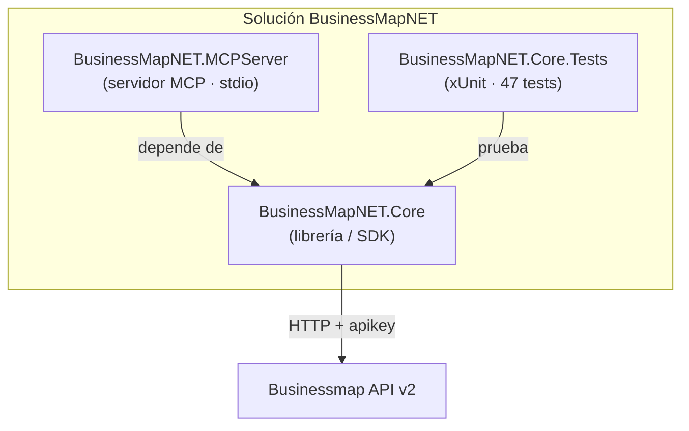
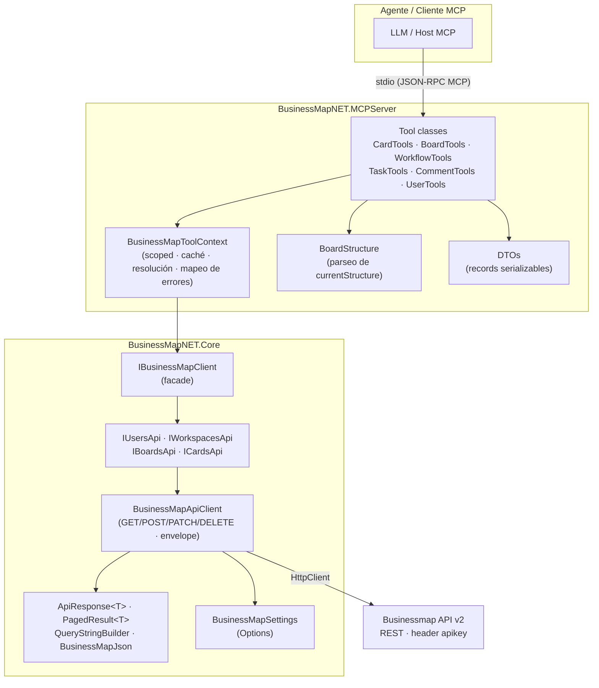
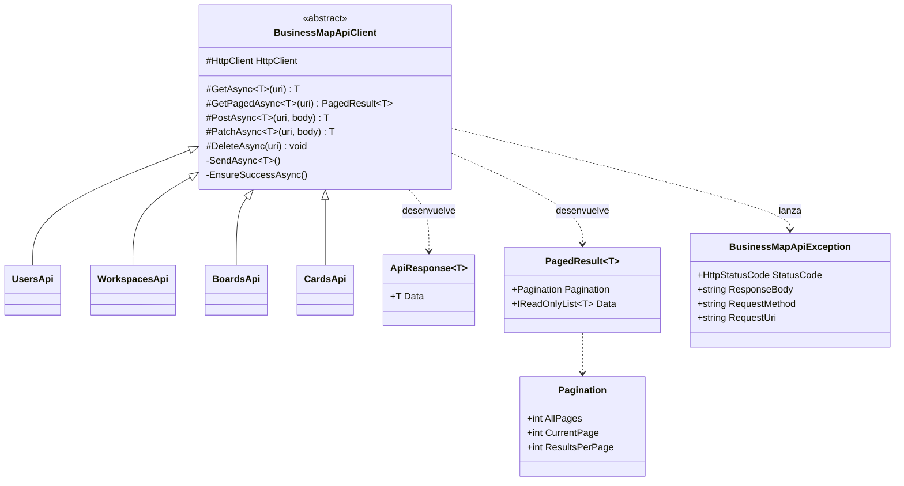
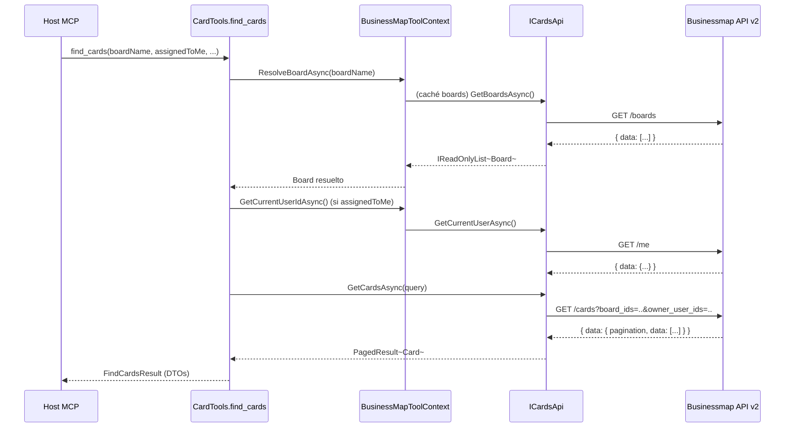
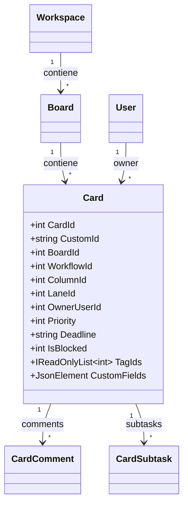

# BusinessMapNET

> **SDK .NET + servidor MCP** para **Businessmap / Kanbanize**. Permite que un agente de IA
> gestione tableros, tarjetas, comentarios y checklists **hablando en lenguaje natural**, sin
> conocer los identificadores internos de la herramienta.

📄 *Idiomas: **Español** · [English](README.md)*

---

## 🎯 ¿Para qué sirve este proyecto?

**BusinessMapNET** conecta la plataforma de gestión de trabajo **Businessmap** (antes Kanbanize)
con **agentes de IA** a través del **Model Context Protocol (MCP)**.

Resuelve dos problemas:

1. **Como desarrollador**, te da un **cliente .NET fuertemente tipado** (`BusinessMapNET.Core`)
   sobre la API REST v2 de Businessmap: modelos inmutables, manejo de errores, paginación y
   configuración lista para inyección de dependencias.
2. **Como usuario de IA**, expone ese cliente como un **servidor MCP** (`BusinessMapNET.MCPServer`)
   con **13 herramientas de alto nivel**. Un asistente (Copilot, Claude, etc.) puede así
   **buscar, crear, mover, asignar y comentar tarjetas** por intención — el servidor traduce
   nombres de tableros/usuarios/columnas a los ids que la API necesita y devuelve mensajes claros.

En la práctica, en lugar de aprender la API o navegar por la interfaz, basta con pedir:
*«¿Qué tarjetas urgentes están bloqueadas en el tablero de Soporte y quién es su responsable?»* y
el agente usa las herramientas del MCP para responder y actuar.

| | |
|---|---|
| 🧩 **Qué es** | SDK .NET 10 + servidor MCP (stdio) |
| 🤖 **Para quién** | Agentes de IA y aplicaciones .NET que integran Businessmap/Kanbanize |
| 🛠️ **Qué ofrece** | 13 herramientas MCP · 22 endpoints tipados · resolución por nombre |
| 🔌 **Cómo se conecta** | Transporte **stdio** (JSON-RPC MCP) |

---

## 💬 Ejemplos de preguntas a un agente IA conectado al MCP

Estas son preguntas y peticiones en **lenguaje natural** que un usuario puede dirigir a un agente
de IA conectado a este servidor MCP. El agente trabaja **por intención**: no necesita conocer ids
internos, ya que las herramientas resuelven tableros, usuarios, columnas y lanes por nombre. Entre
paréntesis se indica la(s) herramienta(s) que el agente utilizaría.

### Descubrimiento y exploración

- «¿A qué tableros tengo acceso?» *(`list_boards`)*
- «Enséñame los tableros cuyo nombre contenga "Entregables".» *(`list_boards`)*
- «¿Cómo está estructurado el tablero "Soporte"? Dime sus columnas, lanes y tipos de tarjeta.»
  *(`get_workflow`)*
- «¿Qué workflows tiene el tablero de "Incidencias"?» *(`get_workflow`)*
- «Lista los usuarios de la cuenta y dame el id de "Dani Puntos".» *(`list_users`)*

### Estado del tablero y seguimiento

- «¿Cómo va el tablero "Entregables"? Dame un resumen operativo.» *(`get_board_status`)*
- «¿Cuántas tarjetas hay bloqueadas o vencidas en el tablero de "Soporte"?» *(`get_board_status`)*
- «¿Quién está sobrecargado en el tablero "Evolutivos"?» *(`get_board_status`)*
- «¿Hay tarjetas sin asignar en el tablero "Entregables"?» *(`get_board_status`)*
- «¿Cuántas tarjetas hay en cada columna del tablero "Incidencias"?» *(`get_board_status`)*

### Búsqueda de tarjetas

- «Busca las tarjetas que me han asignado y están bloqueadas.» *(`find_cards`)*
- «Encuentra tarjetas que mencionen "login" con fecha límite antes del 31 de enero.» *(`find_cards`)*
- «Muéstrame las tarjetas activas de prioridad alta en el tablero "Entregables".» *(`find_cards`)*
- «¿Qué tarjetas tiene asignadas "Dani Puntos" en el tablero de "Soporte"?»
  *(`list_users` + `find_cards`)*
- «Lista las tarjetas archivadas etiquetadas como "urgente".» *(`find_cards`)*

### Detalle e inspección

- «Dame todos los detalles de la tarjeta 12345, incluidos comentarios y subtareas.»
  *(`get_card_details`)*
- «¿Qué comentarios tiene la tarjeta 12345?» *(`get_card_details`)*
- «¿Cuál es el estado del checklist de la tarjeta 12345?» *(`get_card_details`)*

### Crear y actualizar

- «Crea una tarjeta "Arreglar el login" en la columna "Backlog" del tablero "Entregables" y asígnamela.»
  *(`create_card`)*
- «Sube la prioridad de la tarjeta 12345 y ponle fecha límite el 15 de febrero.» *(`update_card`)*
- «Marca la tarjeta 12345 como bloqueada y añádele la etiqueta "riesgo".» *(`update_card`)*
- «Cambia el título de la tarjeta 12345 a "Revisar autenticación".» *(`update_card`)*

### Mover, asignar y colaborar

- «Mueve la tarjeta 12345 a la columna "En progreso".» *(`move_card`)*
- «Asigna la tarjeta 12345 a "Dani Puntos" y añádeme como co-owner.»
  *(`list_users` + `assign_card`)*
- «Añade un comentario a la tarjeta 12345: "Pendiente de validación con el cliente".»
  *(`add_comment`)*

### Subtareas / checklist

- «Añade una subtarea "Escribir pruebas unitarias" a la tarjeta 12345 y asígnamela.» *(`create_task`)*
- «Marca como completada la subtarea 987 de la tarjeta 12345.» *(`complete_task`)*
- «Reabre la subtarea 987 de la tarjeta 12345.» *(`complete_task`)*

### Flujos combinados (varias herramientas)

- «¿Qué tarjetas urgentes están bloqueadas en "Entregables" y quién es su responsable?»
  *(`get_board_status` / `find_cards` + `get_card_details`)*
- «Busca mis tarjetas vencidas, coméntalas con "Revisar plazo" y súbeles la prioridad.»
  *(`find_cards` + `add_comment` + `update_card`)*
- «Crea una tarjeta de "Incidencia crítica" en "Soporte", asígnala a "Dani Puntos" y añade una
  subtarea de diagnóstico.» *(`create_card` + `assign_card` + `create_task`)*

> **Nota:** el agente encadena varias herramientas cuando es necesario (por ejemplo, `list_users`
> para resolver un nombre antes de `assign_card`, o `find_cards` antes de `update_card`). Las
> operaciones de escritura (`create_card`, `update_card`, `move_card`, `assign_card`,
> `add_comment`, `create_task`, `complete_task`) modifican datos reales en Businessmap, por lo que
> conviene confirmarlas antes de ejecutarlas.

---

## 📑 Tabla de contenidos

1. [Visión general](#1-visión-general)
2. [Estructura de la solución](#2-estructura-de-la-solución)
3. [Arquitectura en capas](#3-arquitectura-en-capas)
4. [Patrones y decisiones de diseño](#4-patrones-y-decisiones-de-diseño)
5. [`BusinessMapNET.Core` — detalle técnico](#5-businessmapnetcore--detalle-técnico)
6. [`BusinessMapNET.MCPServer` — información funcional](#6-businessmapnetmcpserver--información-funcional)
7. [Pruebas](#7-pruebas--businessmapnetcoretests)
8. [Modelo de datos](#8-modelo-de-datos-resumen)
9. [Puesta en marcha (quick start)](#9-puesta-en-marcha-quick-start)
10. [Glosario rápido](#10-glosario-rápido)

---

## 1. Visión general

**BusinessMapNET** es una solución .NET 10 organizada en tres proyectos. Su objetivo doble es:

1. Ofrecer un **cliente fuertemente tipado** (`BusinessMapNET.Core`) sobre la API REST v2 de
   Businessmap (Kanbanize).
2. Exponer ese cliente como un **servidor MCP** (`BusinessMapNET.MCPServer`) con herramientas de
   alto nivel, pensadas para que un agente trabaje "por intención" (buscar tarjetas, mover,
   asignar…) sin conocer los identificadores internos.

| Aspecto | Detalle |
|---------|---------|
| Framework | .NET 10 |
| Lenguaje | C# (nullable habilitado, records inmutables) |
| Serialización | `System.Text.Json` (snake_case vía atributos) |
| DI / Config / Logging | `Microsoft.Extensions.*` (Hosting, DependencyInjection, Http, Options) |
| HTTP | `IHttpClientFactory` + `HttpClient` tipado |
| Protocolo agente | `ModelContextProtocol` 1.4.0 (transporte **stdio**) |
| Pruebas | xUnit — 47 tests en `BusinessMapNET.Core.Tests` |
| API destino | `https://{CompanyName}.kanbanize.com/api/v2/` |

---

## 2. Estructura de la solución



| Proyecto | Tipo | Responsabilidad |
|----------|------|-----------------|
| `BusinessMapNET.Core` | Class library | Cliente tipado de la API v2: modelos, endpoints, infraestructura HTTP, configuración y registro DI. |
| `BusinessMapNET.MCPServer` | Console host | Servidor MCP que registra 13 herramientas de alto nivel sobre el Core. |
| `BusinessMapNET.Core.Tests` | xUnit test project | Cobertura del Core: HTTP, query strings, serialización, DI y configuración. |

---

## 3. Arquitectura en capas



**Flujo de una petición del agente**

1. El host MCP invoca una *tool* (p. ej. `find_cards`) por **stdio**.
2. La *tool* usa `BusinessMapToolContext` para resolver board/usuario y construir la consulta.
3. El contexto llama al `IBusinessMapClient` → API de recurso concreta (`ICardsApi`).
4. `BusinessMapApiClient` envía la petición HTTP con el header `apikey`, desenvuelve el sobre
   `data` y devuelve el modelo tipado.
5. La *tool* mapea el modelo del Core a un **DTO** serializable y lo devuelve al agente.

---

## 4. Patrones y decisiones de diseño

| Patrón | Dónde | Propósito |
|--------|-------|-----------|
| **Facade** | `IBusinessMapClient` / `BusinessMapClient` | Punto de entrada único que agrupa las APIs de recurso. |
| **Resource client** | `*Api` (Users, Workspaces, Boards, Cards) | Una interfaz por recurso REST; fácil de mockear/testear. |
| **Template method** | `BusinessMapApiClient` | Métodos `GetAsync/PostAsync/PatchAsync/DeleteAsync` reutilizables por las subclases. |
| **Typed HttpClient** | `AddHttpClient<TInterface,TImpl>` | Configuración e inyección vía `IHttpClientFactory` (base address + header). |
| **Options** | `BusinessMapSettings` + `IOptions<>` | Configuración fuertemente tipada y validada. |
| **Envelope unwrapping** | `ApiResponse<T>` / `PagedResult<T>` | Desenvuelve el `data` estándar de la API de forma centralizada. |
| **Builder** | `QueryStringBuilder` | Construcción segura de query strings (omite nulos/vacíos, escapa claves/valores). |
| **DTO** | `BusinessMapNET.MCPServer.Dtos` | Records inmutables serializables desacoplados de los modelos del Core. |
| **Adapter / Anti-corruption** | `BusinessMapToolContext`, `BoardStructure` | Traduce entre la API (ids crudos) y la intención del agente (nombres, mensajes claros). |
| **Error translation** | `BusinessMapApiException` → `ToolException` | Convierte errores HTTP en mensajes accionables por el agente. |
| **Per-request caching** | `BusinessMapToolContext` (scoped) | Cachea boards, usuarios y estructuras dentro de la misma petición. |

**Convenciones transversales**

- `async/await` con `CancellationToken` en toda la cadena y `ConfigureAwait(false)`.
- Modelos del Core con propiedades `init`-only (inmutables) y `[JsonPropertyName]` snake_case.
- Los logs del servidor MCP van a **stderr** (stdout queda reservado al protocolo MCP).

---

## 5. `BusinessMapNET.Core` — detalle técnico

### 5.1 Facade y APIs de recurso

`IBusinessMapClient` agrega cuatro APIs:

```csharp
public interface IBusinessMapClient
{
	IUsersApi Users { get; }
	IWorkspacesApi Workspaces { get; }
	IBoardsApi Boards { get; }
	ICardsApi Cards { get; }
}
```

### 5.2 Catálogo de endpoints

Todos los endpoints son relativos a `BaseUrl` (`…/api/v2/`) y viajan con el header `apikey`.
<br><br>La API de BusinessMap ofrece múltiples endpoints.
<br>Para este ejemplo se han tomado los siguientes endpoints como muestras más significativas:

#### 👤 `IUsersApi` → `UsersApi`

| Método | HTTP | Endpoint | Devuelve |
|--------|------|----------|----------|
| `GetCurrentUserAsync` | GET | `/me` | `User` |
| `GetUsersAsync` | GET | `/users` | `IReadOnlyList<User>` |

#### 🗂️ `IWorkspacesApi` → `WorkspacesApi`

| Método | HTTP | Endpoint | Devuelve |
|--------|------|----------|----------|
| `GetWorkspacesAsync` | GET | `/workspaces` | `IReadOnlyList<Workspace>` |
| `GetWorkspaceAsync` | GET | `/workspaces/{id}` | `Workspace` |
| `CreateWorkspaceAsync` | POST | `/workspaces` | `Workspace` |
| `UpdateWorkspaceAsync` | PATCH | `/workspaces/{id}` | `Workspace` |

#### 📋 `IBoardsApi` → `BoardsApi`

| Método | HTTP | Endpoint | Devuelve |
|--------|------|----------|----------|
| `GetBoardsAsync` | GET | `/boards` | `IReadOnlyList<Board>` |
| `GetBoardAsync` | GET | `/boards/{id}` | `Board` |
| `CreateBoardAsync` | POST | `/boards` | `Board` |
| `UpdateBoardAsync` | PATCH | `/boards/{id}` | `Board` |
| `DeleteBoardAsync` | DELETE | `/boards/{id}` | `void` |
| `GetBoardStructureAsync` | GET | `/boards/{id}/currentStructure` | `JsonElement` (crudo) |

#### 🃏 `ICardsApi` → `CardsApi`

| Método | HTTP | Endpoint | Devuelve |
|--------|------|----------|----------|
| `GetCardsAsync` | GET | `/cards{?filtros}` | `PagedResult<Card>` |
| `GetCardAsync` | GET | `/cards/{id}` | `Card` |
| `CreateCardAsync` | POST | `/cards` | `Card` |
| `UpdateCardAsync` | PATCH | `/cards/{id}` | `Card` |
| `DeleteCardAsync` | DELETE | `/cards/{id}` | `void` |
| `GetCardCommentsAsync` | GET | `/cards/{id}/comments` | `IReadOnlyList<CardComment>` |
| `AddCardCommentAsync` | POST | `/cards/{id}/comments` | `CardComment` |
| `GetCardSubtasksAsync` | GET | `/cards/{id}/subtasks` | `IReadOnlyList<CardSubtask>` |
| `AddCardSubtaskAsync` | POST | `/cards/{id}/subtasks` | `CardSubtask` |
| `UpdateCardSubtaskAsync` | PATCH | `/cards/{id}/subtasks/{subtaskId}` | `CardSubtask` |

> **Total: 22 endpoints** repartidos en 4 recursos.

### 5.3 Filtros de `GET /cards` (`CardsQuery`)

`CardsQuery.ToQueryString()` serializa solo los filtros no nulos como pares comma-separated:

| Propiedad | Parámetro | Notas |
|-----------|-----------|-------|
| `CardIds` | `card_ids` | Lista de ids |
| `BoardIds` | `board_ids` | Lista de ids |
| `WorkflowIds` | `workflow_ids` | Lista de ids |
| `ColumnIds` | `column_ids` | Lista de ids |
| `LaneIds` | `lane_ids` | Lista de ids |
| `OwnerUserIds` | `owner_user_ids` | Lista de ids |
| `TypeIds` | `type_ids` | Lista de ids |
| `TagIds` | `tag_ids` | Lista de ids |
| `Priorities` | `priorities` | Lista numérica |
| `State` | `state` | `active` / `archived` / `discarded` (minúsculas) |
| `IsBlocked` | `is_blocked` | Booleano → `1` / `0` |
| `Page` | `page` | 1-based |
| `PerPage` | `per_page` | Tamaño de página |

### 5.4 Infraestructura HTTP



Puntos clave de `BusinessMapApiClient`:

- Respuestas envueltas en `{ "data": … }`; los métodos las desenvuelven de forma centralizada.
- Endpoints paginados envuelven además `{ "pagination", "data" }` → `PagedResult<T>`.
- Si falta el payload `data`, o el status no es 2xx, se lanza `BusinessMapApiException`
  (con status, cuerpo, método y URI relativa).
- El cuerpo JSON se (de)serializa con las opciones compartidas de `BusinessMapJson`.

### 5.5 Configuración (`BusinessMapSettings`)

```json
// appsettings.json
{
  "BusinessMap": {
	"CompanyName": "contoso",   // subdominio de la cuenta
	"ApiKey": "••••••••••••••••"        // header apikey
  }
}
```

- `BaseUrl` se calcula: `https://{CompanyName}.kanbanize.com/api/v2/`.
- `Validate()` exige `CompanyName` y `ApiKey` (lanza `InvalidOperationException` si faltan).
- Precedencia en el MCP Server: `appsettings.json` < variables de entorno
  (p. ej. `BusinessMap__ApiKey`).

### 5.6 Registro DI (`AddBusinessMap`)

```csharp
services.AddBusinessMap(configuration);          // enlaza sección "BusinessMap"
// o
services.AddBusinessMap(opts => { /* en código */ });
```

- Cada API de recurso se registra con `AddHttpClient<TInterface, TImplementation>`, que configura
  el `HttpClient` (base address + header `apikey`) y valida la configuración.
- `IBusinessMapClient` se registra como **scoped**.

---

## 6. `BusinessMapNET.MCPServer` — información funcional

El servidor arranca un **Host genérico**, registra `BusinessMapToolContext` (scoped) y monta el
servidor MCP con transporte **stdio** y las 6 clases de herramientas.

### 6.1 Catálogo de herramientas (13)

#### 📋 Tableros — `BoardTools`
| Tool | Función | Parámetros clave |
|------|---------|------------------|
| `list_boards` | Lista tableros accesibles (id, nombre, descripción, workspace). | `nameContains`, `includeArchived`, `limit` |
| `get_board_status` | Snapshot operativo: totales, bloqueadas, vencidas, sin asignar, conteo por columna y por owner. | `boardId` / `boardName` |

#### 🔧 Estructura — `WorkflowTools`
| Tool | Función | Parámetros clave |
|------|---------|------------------|
| `get_workflow` | Workflows, columnas (sección/parent), lanes y tipos de tarjeta del tablero. | `boardId` / `boardName` |

#### 👤 Usuarios — `UserTools`
| Tool | Función | Parámetros clave |
|------|---------|------------------|
| `list_users` | Usuarios de la cuenta (id, nombre, username, email); resuelve nombre → `assigneeUserId`. | `nameContains`, `includeDisabled`, `limit` |

#### 🃏 Tarjetas — `CardTools`
| Tool | Función | Parámetros clave |
|------|---------|------------------|
| `find_cards` | Búsqueda con filtros combinables (texto, board, asignado, workflow, columna, lane, tags, tipo, prioridad, estado, bloqueo, rango de deadline) paginada. | muchos + `page`, `pageSize` |
| `get_card_details` | Detalle completo: campos, board, asignados, tags, comentarios, subtareas y custom fields. | `cardId`, `includeComments`, `includeSubtasks` |
| `create_card` | Crea tarjeta resolviendo columna/lane por id o nombre y validando el tipo. | `title`, `boardId`/`boardName`, `columnId`/`columnName`, … |
| `update_card` | Actualiza campos concretos (título, descripción, prioridad, tamaño, tipo, color, deadline, bloqueo, tags, custom fields). | `cardId` + campos |
| `move_card` | Mueve a otra columna/lane/posición validando el destino. | `cardId`, `columnId`/`columnName`, `laneId`/`laneName`, `position` |
| `assign_card` | Asigna owner y añade/quita co-owners. | `cardId`, `assigneeUserId`, `assignToMe`, `addCoOwnerUserIds`, `removeCoOwnerUserIds` |

#### 💬 Comentarios — `CommentTools`
| Tool | Función | Parámetros clave |
|------|---------|------------------|
| `add_comment` | Añade un comentario a una tarjeta. | `cardId`, `text` |

#### ✅ Subtareas / checklist — `TaskTools`
| Tool | Función | Parámetros clave |
|------|---------|------------------|
| `create_task` | Añade item de checklist, opcionalmente asignado y con deadline. | `cardId`, `description`, `assigneeUserId`/`assignToMe`, `deadline` |
| `complete_task` | Marca (o reabre) una subtarea. | `cardId`, `subtaskId`, `completed` |

**Resumen:** 6 de lectura (`list_boards`, `get_board_status`, `get_workflow`, `list_users`,
`find_cards`, `get_card_details`) y 7 de escritura (`create_card`, `update_card`, `move_card`,
`assign_card`, `add_comment`, `create_task`, `complete_task`).

### 6.2 `BusinessMapToolContext` (helper compartido)

Servicio **scoped** que centraliza las preocupaciones transversales de las tools:

- **Resolución** de board por id o nombre (con detección de ambigüedad y sugerencias).
- **Caché por petición** de boards, usuarios, usuario actual y estructuras de board.
- **Parseo** de `currentStructure` a `BoardStructure` (lookups por id/nombre de columnas, lanes,
  tipos).
- **Mapeo** de modelos del Core a DTOs (`ToSummary`, `ToInfo`, `ReadCustomFields`).
- **Traducción de errores**: `BusinessMapApiException` → `ToolException` con mensaje según el
  status (401/403, 404, 422, 429, 5xx…).

### 6.3 Secuencia de ejemplo — `find_cards`



---

## 7. Pruebas — `BusinessMapNET.Core.Tests`

Proyecto **xUnit** con **47 tests** que cubren el Core (sin llamadas reales a la API, usando
handlers HTTP simulados). Áreas cubiertas:

| Área | Ejemplos de casos |
|------|-------------------|
| `Http/QueryStringBuilder` | omisión de nulos/vacíos, colecciones comma-separated, escape, `?`/`&`. |
| `Models/CardsQuery` | serialización de filtros escalares y de colección, `state` en minúsculas, `is_blocked` → 0/1. |
| `Models/CardSerialization` | mapeo snake_case, `init`-only, JSON anidado crudo, `PagedResult` (paginación + data). |
| `Services/CardsApi` | URI relativa, query string, desenvoltura del sobre, errores → `BusinessMapApiException`. |
| `Services/BoardsApi` | endpoint `currentStructure`, desenvoltura de array, validación de request nulo. |
| `Configuration/BusinessMapSettings` | `BaseUrl` desde `CompanyName`, validaciones de faltantes. |
| `DependencyInjection` | enlace desde configuración, delegado en código, fallo diferido si faltan settings. |

Ejecutar las pruebas:

```powershell
dotnet test
```

---

## 8. Modelo de datos (resumen)



> Los modelos del Core exponen los campos más usados como propiedades tipadas y conservan las
> estructuras anidadas ricas (custom fields, stickers, subtasks) como `JsonElement` crudo para
> tolerar cambios de la API.

---

## 9. Puesta en marcha (quick start)

### 9.1 Configurar credenciales

| Clave | Qué es | Ejemplo |
|-------|--------|---------|
| `CompanyName` | Subdominio de la cuenta Business Map (Kanbanize) | `contoso` |
| `ApiKey` | Clave enviada en el header `apikey` | `xxxxxxxxxxxxxxxx` |

**Opción A — `appsettings.json`** (desarrollo local):

```json
{
  "BusinessMap": {
	"CompanyName": "contoso",
	"ApiKey": "TU_API_KEY_AQUI"
  }
}
```

**Opción B — variables de entorno** (recomendada; usan doble guion bajo `__`):

```powershell
$env:BusinessMap__CompanyName = "contoso"
$env:BusinessMap__ApiKey = "TU_API_KEY_AQUI"
```

### 9.2 Arrancar el servidor MCP

```powershell
dotnet run --project .\BusinessMapNET.MCPServer
```

El servidor usa transporte **stdio** y envía los logs a **stderr**. Si faltan `CompanyName` o
`ApiKey`, fallará con un `InvalidOperationException` claro.

### 9.3 Registrarlo en Visual Studio (`.mcp.json` en la raíz de la solución)

El host MCP (Visual Studio) lee `.mcp.json` para saber **cómo arrancar** el servidor. En este
repositorio ese fichero está **excluido de git** (`.gitignore`), porque contiene una ruta
específica de la máquina y referencias a secretos locales. La configuración realmente utilizada
sigue este patrón:

```json
{
  "servers": {
	"kanbanize": {
	  "type": "stdio",
	  "command": "<ruta-a>\\BusinessMapNET.MCPServer\\bin\\Debug\\net10.0\\win-x64\\BusinessMapNET.MCPServer.exe",
	  "args": [],
	  "env": {
		"BusinessMap__CompanyName": "${env:BUSINESSMAP_COMPANY}",
		"BusinessMap__ApiKey": "${env:BUSINESSMAP_APIKEY}"
	  }
	}
  }
}
```

Puntos clave de esta configuración:

- **`command`** apunta directamente al **ejecutable autocontenido** ya compilado (ruta específica
  de la máquina), en lugar de invocar `dotnet run`.
- **`env`** inyecta las credenciales como variables `BusinessMap__*`, tomando su valor de las
  variables de entorno de la máquina mediante `${env:...}`; así **no hay secretos escritos** en el
  fichero.
- Al usar el prefijo `BusinessMap__`, estas variables tienen **precedencia** sobre `appsettings.json`.
  Si no están definidas, el servidor recae en los valores de `appsettings.Development.json`.

> ⚠️ **Seguridad:** no subas tu `ApiKey` al repositorio. Mantén los secretos en variables de
> entorno o en ficheros ignorados por git (`appsettings.Development.json`, `.mcp.json`).

---

## 10. Glosario rápido

| Término | Significado |
|---------|-------------|
| **Board** | Tablero Kanban. Contiene workflows, columnas y lanes. |
| **Workflow** | Flujo dentro de un board (p. ej. Incidencias, Evolutivos). |
| **Column** | Columna del board; su `section` indica la fase del ciclo de vida (1 backlog … 4 done). |
| **Lane** | Carril horizontal del board. |
| **Card** | Tarjeta / unidad de trabajo. |
| **Owner / Co-owner** | Responsable principal / secundarios de una tarjeta. |
| **Subtask** | Item de checklist dentro de una tarjeta. |
| **MCP** | Model Context Protocol; expone herramientas a agentes de IA vía stdio. |
